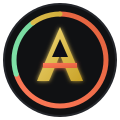
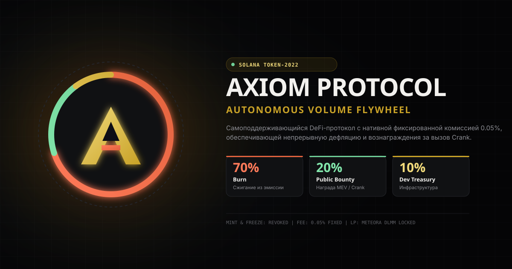
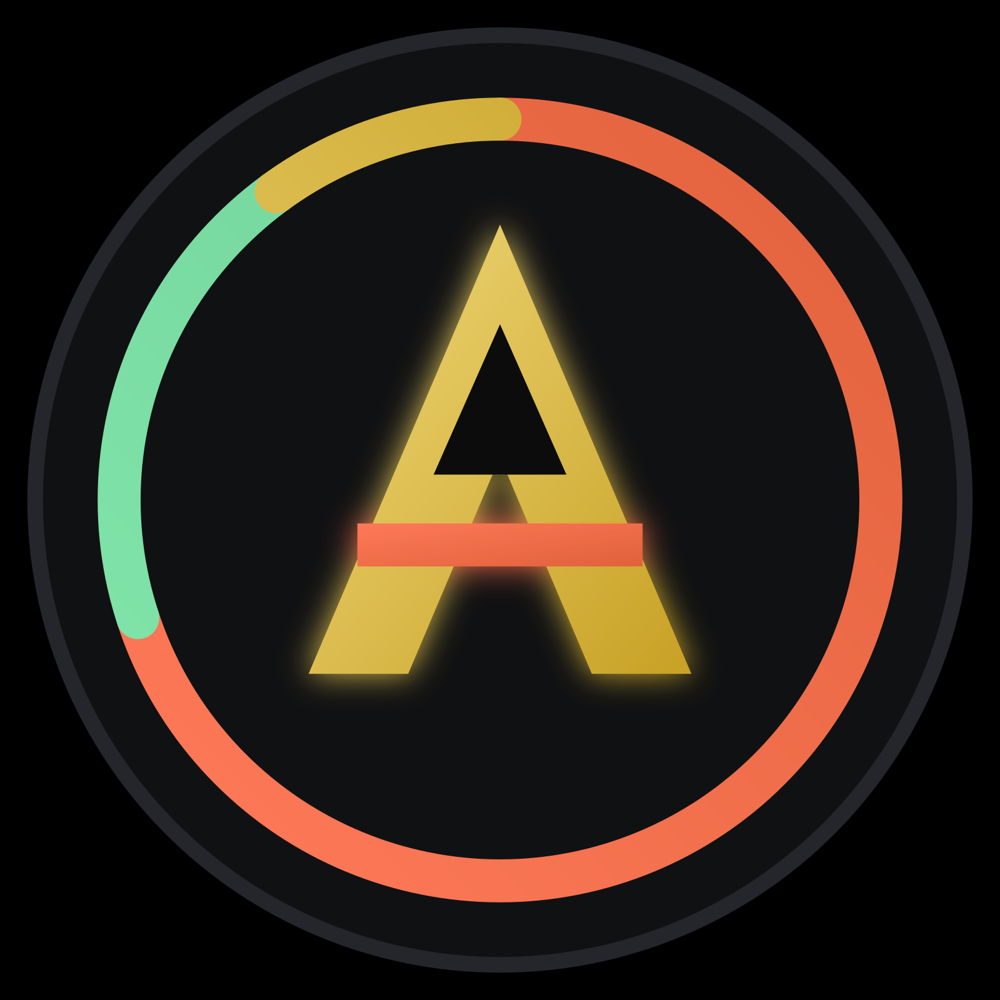

<p align="center">
  
</p>

<h1 align="center">AXIOM Protocol ($AXIOM)</h1>

<p align="center">
  <b>Autonomous DeFi Liquidity & Tokenomics Flywheel on Solana</b>
</p>

<p align="center">
  
</p>

<p align="center">
  <a href="https://solana.com"></a>
  <a href="#-токеномика-и-механика"></a>
  <a href="https://www.anchor-lang.com"></a>
  <a href="LICENSE"></a>
</p>

---

## 📌 О проекте

**AXIOM Protocol** — это полностью автономный DeFi-протокол нового поколения на блокчейне Solana, использующий расширение **Token-2022 Transfer Hook**. Протокол взимает фиксированную нативную комиссию 0.05% с каждой транзакции, создавая непрерывный дефляционный маховик сжигания и стимуляции публичных исполнителей (Crank Executors).

---

## 🎨 Графические ресурсы бренда (Brand Assets)

В репозитории используются следующие варианты визуализации для поддержки браузеров, социалок и криптовалютных кошельков:

| Файл | Формат | Превью | Назначение |
| :--- | :--- | :---: | :--- |
| `axiom-logo.svg` | Вектор (SVG) |  | Шапка сайта (Navbar), адаптивный векторный интерфейс, масштабируемые dApp-компоненты |
| `axiom-logo.png` | Растр (PNG) |  | Фавиконка браузера, иконка токена в Phantom / Solflare, CoinGecko, Telegram-боты |
| `axiom-banner.svg` | Вектор (SVG) | *(см. баннер вверху)* | Карточка репозитория GitHub, OpenGraph preview, презентационные соцсети |

---

## 💡 Токеномика и механика

Каждый перевод токенов $AXIOM удерживает фиксированную комиссию **0.05%**, которая собирается в нативном хранилище контракта. Автоматический вызов функции `harvest` (Crank) распределяет собранные средства по фиксированной пропорции:

```mermaid
graph TD
    A[Транзакция перевода $AXIOM] -->|Нативная комиссия 0.05%| B(Token-2022 Fee Vault)
    B -->|Публичный вызов Crank| C{AXIOM Distribution Hook}
    C -->|70%| D[🔥 Burn Account / Окончательное сжигание]
    C -->|20%| E[⚡ Public Bounty / Награда вызвавшему Crank]
    C -->|10%| F[🛡️ Dev Treasury / Развитие и инфраструктура]
